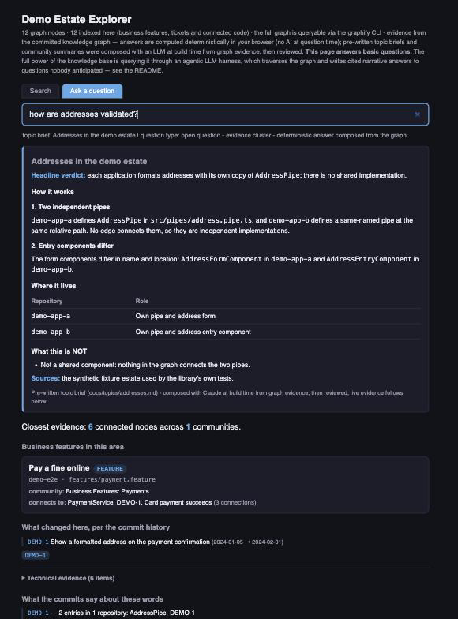

# knowledge-store-builder

Ask questions about a software estate and get answers that cite the code,
the commits and the tickets behind them.

> Which applications implement their own address formatting, and which tickets
> changed them?



That is `explorer.html`, one of the artefacts a build produces. It is a single
file, it runs from `file://`, and it answers with no server, no network and no
LLM. The screenshot is this repository's own test fixture, so you can produce
it yourself: `python3 tests/explorer/fixture.py`.

Note the section headed **What this is NOT**. Two applications have a
same-named `AddressPipe` and no edge connects them, so the store reports them
as independent implementations rather than guessing they are shared. Absence of
evidence is a finding here, not a silence.

## What a build produces

Point the library at a GitHub organisation, choose the repositories, and it
writes static files you commit alongside the code:

| Artefact | What it holds |
|---|---|
| `graphify-out/graph.json` | the estate graph — code, concepts, business features, deployments |
| `graphify-out/explorer.html` | the self-contained page above |
| `knowledge/git-history/` | per-repository commit history as NDJSON |
| `knowledge/intent/` | which tickets changed which files |
| `knowledge/summaries/`, `docs/topics/`, `docs/deep-dives/` | prose an LLM wrote at build time from graph evidence, then reviewed |

Everything is a committed file. Consumers clone and read; nothing is computed
at query time.

## The three ways to ask

**In a browser** — open `explorer.html`. No install, no Claude licence, no
network.

**In Claude Code** — install the plugin and ask in English. The skill reads the
committed artefacts and cites them.

```
/plugin marketplace add hmcts/knowledge-store-builder
/plugin install knowledge-store@knowledge-store-builder
/reload-plugins
```

**From the terminal** — `graphify query` against the committed graph.

## Building a store

The library ships the `knowledgestore` command, one stage per step. A build is
that sequence run in order, and each stage writes files the next one reads:

```bash
knowledgestore discover        # list the estate's repositories
knowledgestore sync            # clone or update them
knowledgestore extract-ast     # the code layer, one repository at a time
knowledgestore export-history  # per-repository commit history
knowledgestore intent          # join files to the tickets that changed them
knowledgestore explorer        # build the page
knowledgestore status          # what is present, what is stale
```

`knowledgestore` with no arguments lists all 32 stages with a line each.
`knowledgestore <stage> --help` explains one. The full sequence, the extraction
extras and the authoring steps are in
[Creating a knowledge store](docs/creating-a-store.md), which also carries the
install command — the guides own install detail so there is one copy to keep
correct.

Building needs Python 3.10+, Git, the GitHub CLI and
[graphify](https://github.com/safishamsi/graphify), which does the extraction.
This library prepares its inputs and enriches its output; it does not
re-implement it.

## Start here

| You want to | Go to |
|---|---|
| ask questions about a store someone built | [Asking questions](docs/asking-questions.md) |
| build a store for your estate | [Creating a knowledge store](docs/creating-a-store.md) |
| refresh a store you maintain | [Refreshing a store](docs/refreshing-a-store.md) |
| see every command with nothing around it | [`CHEATSHEET.md`](CHEATSHEET.md) |

Asking needs the plugin and nothing else — no Python, no `pip`. Without a
Claude licence, `explorer.html` answers in a browser.

## How it is designed

- **The store is the product.** Outputs are committed static files. Consumers
  clone and read; nothing is built at query time.
- **The browser has no query-time LLM.** Whoever builds a store may have a
  licence; the people querying it may not, and `explorer.html` is committed for
  them. Everything an LLM writes during the build is committed as reviewed
  static text. Claude Code reads the same evidence when a question needs a new
  prose answer.
- **Deterministic where it can be.** Extraction, indexing and page composition
  are pure functions of the sources; two runs on the same inputs produce
  byte-identical output.
- **Per-commit history stays out of the graph.** It is exported alongside as
  NDJSON, because "what changed last sprint" is a dataset query, not a graph
  traversal — and it keeps the committed graph an order of magnitude smaller.
- **Absence of evidence is a finding.** Same-named components with no
  connecting edge are independent implementations, and the tooling says that
  rather than guessing.

## Reference documentation

| Document | For |
|---|---|
| [`CHEATSHEET.md`](CHEATSHEET.md) | the commands, per surface, with nothing else around them |
| [`docs/asking-questions.md`](docs/asking-questions.md) | asking questions with Claude Code, `explorer.html` or `graphify query` |
| [`docs/creating-a-store.md`](docs/creating-a-store.md) | creating, building and publishing a new store |
| [`docs/refreshing-a-store.md`](docs/refreshing-a-store.md) | refreshing an existing store and changing its pinned library version |
| [`docs/configuring-a-store.md`](docs/configuring-a-store.md) | pipeline settings, BDD support and stage outputs |
| [`docs/building-a-knowledge-store.md`](docs/building-a-knowledge-store.md) | the operator's judgement: defining an estate, what extraction yields, refresh economics, the traps |
| [`docs/grounding-and-verification.md`](docs/grounding-and-verification.md) | whether a store's answers are fact-based, and how to verify subagent-authored content |
| [`docs/retrieval-architecture.md`](docs/retrieval-architecture.md) | how this differs from vector RAG, and where each answer layer lives |
| [`docs/how-it-works.md`](docs/how-it-works.md) | the science: each mechanism, its constants, and where its behaviour is proven |
| [`CLAUDE.md`](CLAUDE.md) | working on this repository: the dev install, the checks, and what has bitten us |

## Licence

MIT. See [LICENSE](LICENSE).
